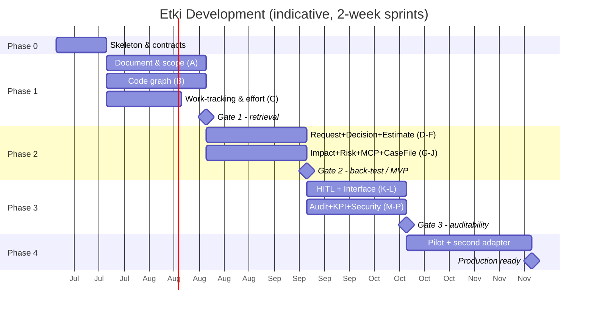
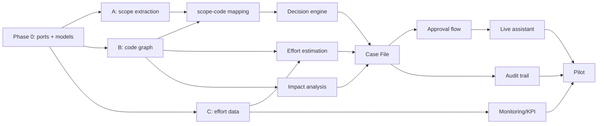

# PMO Decision-Support System — Development Plan
## *code name: Etki* · Development Plan

| | |
|---|---|
| **Version** | 0.1 |
| **Date** | 23 June 2026 |
| **Related document** | Architecture Design Document v0.2 |
| **Scope** | From scratch to production: phases, epics, sprints, exit criteria |

> This plan makes the 3-stage roadmap from the architecture document **actionable**. The phases are **gate-based**: you never advance to the next phase until a measurable exit criterion is met. The schedule is **sprint-based** (not absolute dates); it is tuned to the team and the degree of parallelization.

> **Current status (2026-06-30, alpha 0.1.0a1).** Phases 0–4 are implemented; the product is **Etki** (Apache-2.0, alpha). The main items that diverge from or were added beyond the plan: a project-centric UI redesign (the global dashboard was removed), automatic developer pre-analysis + chat, an interactive Sankey flow graph, **removal of monetary cost** (effort range only), a **multilingual UI (TR/EN/DE)** and a **per-project LLM profile** (language + `config/domains/*.md` domain/skill profile + free-text instructions + optional pivot translation), real login (X-Role removed), Alembic, and a JVM-free container. **LLM:** the current implementation uses the **Anthropic Claude API** (cloud, off by default); the **on-prem vLLM** narrative below is a historical vision / a deferred option, not the current default. Not yet present: a real customer pilot (live data), ML-regression estimation, per-project RBAC + multi-customer DB isolation, full OAuth/SSO, a customer portal. For the implementation reality, the repo `CLAUDE.md`/`README.md` are the source of truth.

---

## 1. Approach and Core Principles

1. **Vertical slice first (walking skeleton).** The first goal is not to build out the full breadth; it is to produce a **thin vertical slice** that works end to end for *a single contract + a single repo + a single work-tracking source*: one document → one scope item → one code module → one decision → one approval. Once the pipeline is proven from end to end, it is deepened. This eliminates the biggest risk (the parts not connecting to each other) early.

2. **Gate-based phases.** Each phase has a concrete **exit criterion** (e.g. "for a past CR, can the correct scope clause + correct code region be retrieved?"). If the criterion is not met, you do not advance until the bottleneck is resolved.

3. **Build the core, adopt the component.** The decision engine, baseline manager, and connector layer → are **written**. Code intelligence (Joern), model serving (vLLM), contract extraction (the LLM+RAG pattern) → are **off-the-shelf/open-source**.

4. **Vendor independence from day 1.** The port interfaces (`WorkItemProvider`, `CodeRepositoryProvider`, `DocumentSourceProvider`) are defined at the very start; an **in-memory fake adapter** is written for each port for testing. The real adapters (GLPI, git, FileSystem) plug in behind these.

5. **AI-assisted development.** Repetitive work (adapter skeletons, test generation, schema transformations) is accelerated with Claude Code; engineer effort concentrates on the high-value parts such as decision logic, calibration, and validation.

### MVP Definition (Minimum Lovable Product)
> For a single configured project (one contract + one repo + one work-tracking source), a live assistant that takes a natural-language request and returns a **scope decision + impact analysis + effort range + evidence chain**, presenting it for **PMO approval**.

**Included** in the MVP: the vertical slice, the decision engine, range estimation, the evidence chain, a basic approval interface, and the GLPI + git + FileSystem reference adapters.
**Post-**MVP: second adapters (Jira/GitHub/SharePoint), a full KPI dashboard, advanced risk scoring, multi-project scale, a customer-facing interface.

---

## 2. Assumptions (tunable)

| Assumption | Value | Note |
|----------|-------|-----|
| Team size | 2–4 people | Works with one person too, the schedule stretches |
| Sprint length | 2 weeks | |
| First target product | MVP (Phase 0–3 vertical slice) | ~10–12 sprints |
| Full product (pilot + multi-adapter) | +Phase 4 | ~+2–3 sprints |
| LLM infrastructure | On-prem vLLM (existing) | No from-scratch setup needed |
| Development method | AI-assisted (Claude Code) | Estimates assume this |

---

## 3. Team & Roles

| Role | Responsibility | Intensity |
|-----|-----------|----------|
| **Backend/ML Lead** | Decision engine, estimation, baseline manager, orchestration | Full |
| **Integration Eng.** | Connector layer, adapters, MCP, code indexing | Full |
| **Frontend Eng.** | Live assistant interface, case-file review screen, KPI dashboard | From Phase 3 onward |
| **PMO / Domain Expert** | Scope-extraction validation, gate tests, back-test data | Part-time |

> In a small team, the Backend/ML Lead + Integration Eng. carry the core; the Frontend and PMO expert come into play in specific phases.

---

## 4. Technical Setup (alongside Phase 0)

- **Monorepo** skeleton: `core/` (domain + ports), `adapters/` (vendor adapters), `engine/` (decision/estimation/risk), `api/` (FastAPI), `ui/`, `tests/`, `eval/` (gate/back-test harness).
- **Development environment:** vLLM endpoint (OpenAI-compatible), PostgreSQL, vector DB, embedding model; `.env` + config-driven adapter selection.
- **CI/CD:** lint + type checking + unit/integration tests; the `eval/` harness running on every PR.
- **Observability:** structured logging (for the evidence chain/audit from the start), prompt/model version tagging.

---

## 5. Phase Plan

### Phase 0 — Skeleton & Contracts · *~1 sprint*
**Goal:** An empty but end-to-end working skeleton; with the fake adapters, a request can be entered and a fake decision returned.

**Epics / work:**
- Define the port interfaces (Protocol): `WorkItemProvider`, `CodeRepositoryProvider`, `DocumentSourceProvider` + capability declaration.
- Write the core data models (Pydantic): `ScopeItem` (polarity), `Baseline`, `WorkItem`, `Code Module`, `Triage Decision`, `Evidence Chain`, `CaseFile`.
- An **in-memory fake adapter** for each port (test fixtures).
- FastAPI skeleton + a single endpoint: `POST /triage` (returns a fake response).
- CI + `eval/` harness skeleton.

**Exit criterion (gate):** A `POST /triage` call with fake data returns a `CaseFile` end to end; tests are green.

---

### Phase 1 — Data Backbone · *~3–4 sprints*
**Goal:** The three real feed paths (document, code, effort) work behind connectors; the scope↔code mapping is established. *(Architecture roadmap Stage 1)*

**Epic A — Document & Scope Extraction** (`DocumentSourceProvider`)
- FileSystem adapter (first); then an interface ready for SharePoint.
- Document parsing (Tika/docx) → text.
- LLM + RAG + **schema-constrained** extraction → `ScopeItem` (included + **excluded/EXCLUDED**).
- A legal model layer (HukukBERT) for Turkish contract language + a (simple) human-validation interface.

**Epic B — Code Knowledge Graph** (`CodeRepositoryProvider`)
- Git adapter (clone/fetch, commit history=churn, incremental diff).
- Indexing with Joern/tree-sitter → `Code Module` + dependency graph + complexity/churn metrics.
- **Incremental re-indexing** (git-diff driven) + freshness stamp.

**Epic C — Work Item & Effort** (`WorkItemProvider`)
- GLPI reference adapter → normalized `WorkItem.effort_seconds` (sum of task `actiontime`).
- Similar-work retrieval (searching past tickets).

**Cross-cutting — Scope↔Code Mapping**
- Each `ScopeItem` ↔ relevant `Code Module` link (during indexing).

**Exit criterion (gate):** For a known past CR, the system retrieves (a) the correct scope clause **and** (b) the correct code regions. Retrieval precision/recall is measured and passes the acceptance threshold. *If it doesn't pass: you do not advance to Phase 2 until grounding is fixed.*

---

### Phase 2 — Triage & Estimation (Core Brain) · *~3–4 sprints*
**Goal:** The system produces a real decision + evidence + range estimate + risk. *(Stage 2)*

**Epic D — Request Understanding**
- Natural language → atomic sub-requirements (Turkish NLP); module-hint extraction.

**Epic E — Decision Engine**
- Decision tree: maintenance scope → negative scope match → code+text match → limit/quota → effort pool.
- **Two-evidence rule** (text + code); on conflict → gray area → PMO.

**Epic F — Effort Estimation**
- Analogy (work-tracking actual effort) + code metrics + (later) ML regression.
- **Range output**: three-point / Monte Carlo + basis (never a single number).

**Epic G — Impact Analysis**
- Wave propagation through the dependency graph (direct / 1st/2nd degree); high-churn warning.

**Epic H — Risk Scoring**
- Probability × impact from signals → matrix position + escalation flags.

**Epic I — MCP Layer**
- The code graph + work-tracking + document store are exposed to vLLM as MCP tools.

**Epic J — Case File + Evidence Chain**
- Decision + confidence + evidence (clauses, modules, reasoning) + model/prompt version + freshness.

**Exit criterion (gate):** **Back-test** over past CRs — decisions agree with the PMO's historical decision at ≥70–80%; actual effort falls within the estimated range. Out-of-scope detection precision/recall is also tracked.

> **The MVP appears here:** the Phase 0–2 vertical slice + simple approval = the first showable/pilotable product.

---

### Phase 3 — HITL, Interface & Audit · *~3–4 sprints*
**Goal:** The human approval flow, the live assistant interface, audit, and monitoring are complete. *(Stage 3)*

**Epic K — Human Approval Flow**
- LLM recommends → PMO approves/rejects/converts to CR; a flow that pauses and resumes state (state management). CR approval → baseline version +1.

**Epic L — Live Assistant Interface** *(flagship feature)*
- Meeting scenario: natural-language input → a card output within seconds (decision + effort + risk + impacted modules).
- Case-file review screen (toggle evidence open/closed).

**Epic M — Audit Trail**
- Decision events, model/prompt version, evidence, confidence, human overrides — with consistent identifiers, reconstructable after the fact.

**Epic N — Monitoring & KPI Dashboard**
- Effort-pool monitoring + early-warning thresholds (🟡/🔴); CPI/SPI, CR approval speed, agreement %, estimate accuracy; a maintenance-revenue tracking view.

**Epic O — Security & Compliance**
- Put vLLM behind an authenticated reverse proxy + internal network + RBAC; KVKK/VERBİS registration + DPIA.

**Epic P — Feedback Loop**
- PMO decisions → estimate/threshold calibration.

**Exit criterion (gate):** Every decision can be reconstructed for a contractual dispute; the over-reliance check works (override/correction rate is monitored); security hardening and the KVKK steps are complete.

---

### Phase 4 — Pilot & Productization · *~2–3 sprints*
**Goal:** Pilot on a real project + proof of pluggability.

**Epics / work:**
- Pilot on a real active project (shadow mode: the system recommends, the PMO makes its decision separately, the two are compared).
- Calibration with pilot data (estimate ranges, thresholds, confidence).
- Prove pluggability with a **second adapter**: Jira *or* GitHub *or* SharePoint — without changing the core.
- Operations: deployment, backup, index-refresh scheduling, runbook.
- Productization decision (multi-project, multi-customer, licensing).

**Exit criterion (gate):** In the pilot, decision accuracy and effort range are acceptable; at least one alternative adapter was brought online without touching the core code.

---

### Post-plan extension — GraphRAG Decision Memory · *implemented 2026-07*

After Phases 0–4 landed, a four-phase **decision-memory layer** was planned and built
in its own document, `Etki_GraphRAG_Hafiza_Plani.md` (which also records the
repo-audit that re-scoped the original draft): **(1)** a decision wiki that is a pure
DB projection (`WikiStore` port, `python -m etki.wiki`), **(2)** a triple-strategy
`GraphQueryPort` (top-k / token-budgeted expand / guarded NL query) with its own
pre-committed retrieval eval set and CI gate, **(3)** a HITL ingest loop (overrides →
precedents, clause conflicts → disputed; idempotent by projection, no queue), and
**(4)** rerank-packed context expansion behind the existing cross-encoder port.
Gate discipline carried over: the eval dataset was committed *before* the retrieval
code (freeze guard), and the rerank arm ships as a measured A/B, not an assumed win.

---

## 6. Milestones & Timeline (indicative)

| Milestone | When (indicative) | Meaning |
|----------------|---------------------|--------|
| **Gate 1** | ~end of Phase 1 | Grounding correct: scope + code can be retrieved |
| **Gate 2 / MVP** | ~end of Phase 2 | Real decision + estimate; pilotable vertical slice |
| **Gate 3** | ~end of Phase 3 | Approval + interface + audit + security complete |
| **Production ready** | ~end of Phase 4 | Pilot successful + pluggability proven |

> Sprint counts are indicative; absolute dates change with team/parallelization. The Phase 1 epics (A/B/C) can run in parallel → the biggest acceleration opportunity is here.

---

## 7. Dependencies & Critical Path

**Critical path:** `Phase 0 → (A + B) → scope-code mapping → decision engine → case file → approval/interface → pilot`. If the code graph (B) and scope extraction (A) finish early, everything speeds up; these are the **highest-risk + highest-value** epics, so the most experienced person(s) should be placed here.

---

## 8. Test & Validation Strategy

- **Unit tests:** decision-tree branches, the estimation function, adapter normalization (with fake adapters).
- **Integration tests:** end-to-end `POST /triage` (fake + real adapter).
- **Gate/back-test harness (`eval/`):** a labeled set from past CRs; runs on every PR.
  - *Retrieval metric* (Gate 1): precision/recall of retrieving the correct scope item + code region.
  - *Decision metric* (Gate 2): agreement with the historical PMO decision; out-of-scope detection precision/recall.
  - *Estimation metric*: the rate at which actual effort falls within the estimated range (calibration).
- **Over-reliance check** (Gate 3): the PMO override/correction rate is monitored (rubber-stamping is caught early).
- **Shadow-mode pilot** (Phase 4): the system recommends, the real decision is made separately, the two are compared.

---

## 9. Development Risks & Mitigations

| Risk | Mitigation |
|------|-------|
| **Weak scope extraction (ambiguous contract language)** | Gray area + human validation; legal model; capture EXCLUDED as first-class |
| **Code indexing/impact analysis heavier than expected** | Single-language/single-repo vertical slice first; take Joern off-the-shelf; incremental index |
| **Poor work-tracking data hygiene → weak analogy** | Increase the weight of code metrics; start data discipline; keep the range wide |
| **Inaccurate estimate → loss of PMO trust** | Always a range + basis; calibrate in shadow mode; never give a single number |
| **Scope creep (gold-plating)** | Keep the MVP strict; KPI dashboard/multi-adapter post-MVP |
| **Single-person dependency (bus factor)** | Document port contracts + tests; speed via AI-assisted, but with code review |
| **Security/KVKK is expensive if added later** | Audit trail and logging from Phase 0; security mandatory at the Phase 3 gate |

---

## 10. Definition of Done

An epic counts as "done" if: its code is written + unit/integration tests are green + it did not lower the `eval/` metrics + it is documented (port contract/usage) + its contribution to the relevant phase gate is verified + (if needed) the logging/audit fields are populated.

---

*This plan should be read together with architecture document v0.2. Sprint counts and dates are indicative and will be updated according to the team structure.*
