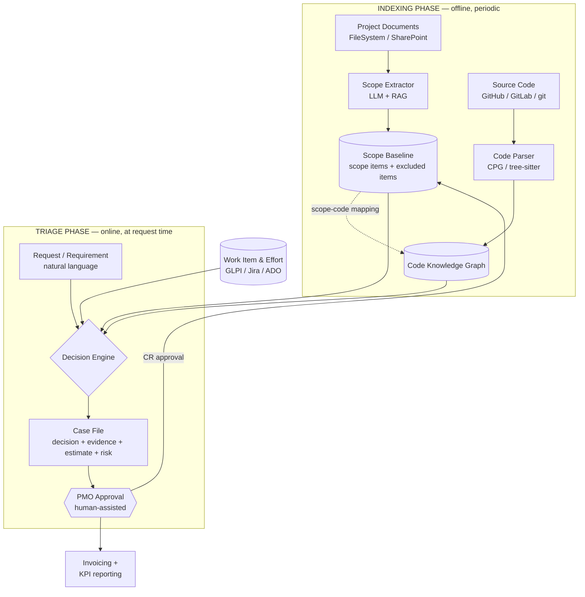
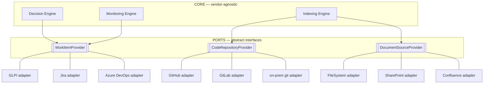
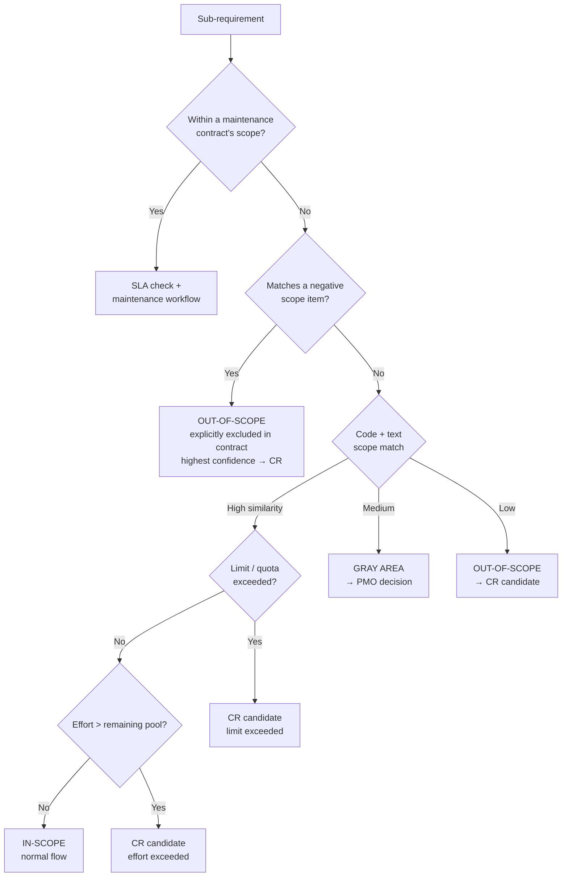
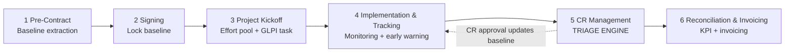
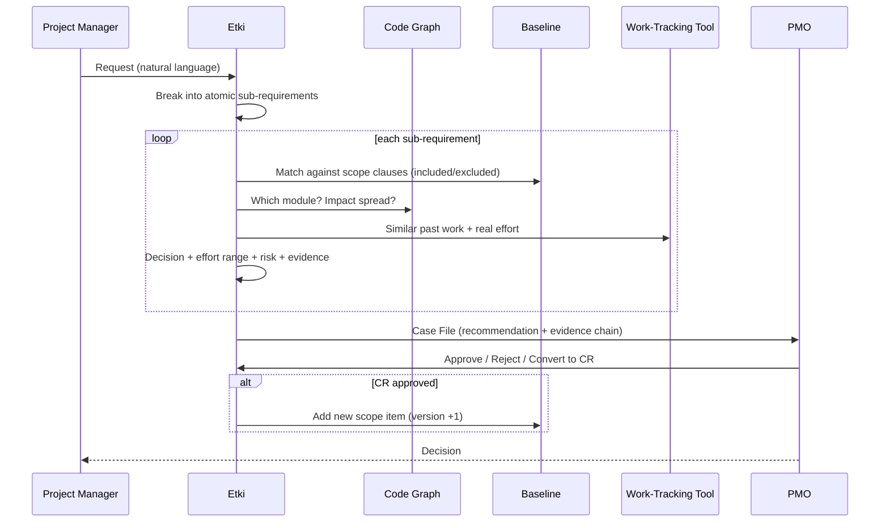
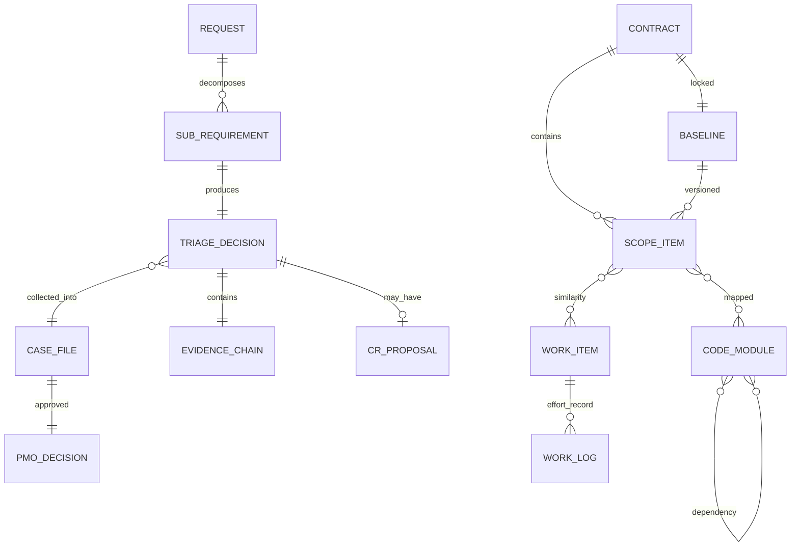

# PMO Decision Support System
## Architecture Design Document — *code name: Etki*

| | |
|---|---|
| **Version** | 0.2 (Draft) — *connector/adapter layer added (vendor-agnostic integration)* |
| **Date** | 23 June 2026 |
| **Scope** | Architecture + process flows + risk/KPI integration |
| **Target audience** | Mixed (PMO/management + technical team) |
| **Status** | Concept design — pre-PoC |

> **Reading guide.** This document is layered. For management and PMO readers, **Section 1 (Executive Summary)**, **Section 2 (Purpose & Usage)** and **Section 5 (Process Flows)** give a sufficient picture. The technical team can additionally dive into **Sections 3–4 (Architecture & Components)**, **Section 6 (Data Model)** and **Section 7 (Technology)**. For non-technical readers, terms are explained in **Appendix A (Glossary)**.

> **Current implementation status (2026-06-30, alpha 0.1.0a1).** This document preserves the **vision**; the implementation has moved ahead in some places. In summary: the product was named **Etki** (Apache-2.0, alpha); the interface was restructured to be **project-centric** (landing = Projects; each project has Summary/Files/Triage/History/Analyses/Approvals/Reports/Flow) and the global dashboard was removed; an **automatic developer pre-analysis** after triage + chat over the output were added; an **interactive Sankey** (Request→Requirement→Code) flow graph was added; **monetary cost was removed** → decisions present **effort ranges only** (see Section 4.5/6); the interface became **multilingual (TR/EN/DE)**; and each project gained a **dedicated LLM profile** (output language + selectable domain/skill profile `config/domains/*.md` + free-text instructions + optional pivot translation). Authentication moved to **real login** (the old `X-Role` was removed). **LLM:** the current implementation uses the **Anthropic Claude API** (cloud) behind a single `LLMClient` port, and the LLM is **off by default** (without a key, the deterministic/heuristic path is used). The **on-prem vLLM / local inference** narrative that appears in the sections below is the historical **vision** — it remains a deferred option for installations requiring KVKK/data-residency, but it is not the current default. For current implementation details, `CLAUDE.md` and `README.md` in the repository are the source of truth.

---

## 1. Executive Summary

### 1.1 Problem
A PMO running software projects faces the same question every day while managing turnkey, change-request (CR — Time & Material) and maintenance contracts: **"Is this request in-scope or out-of-scope; does it exceed the effort budget; should it become a CR; and what does it cost?"** Today these decisions rest largely on individuals' memory, reading the contract clause by clause, and experience. As a result:

- Most scope disputes arise from the "this was discussed / was not discussed" uncertainty (scope creep).
- Impact analysis and effort estimation are manual, slow and person-dependent.
- Because decision rationales are not documented, there is no concrete basis at hand during CR negotiations with the customer.

Industry data confirms the prevalence of this problem: according to PMI research, more than half of projects experience scope creep, and this rate increases year over year.

### 1.2 Solution
**Etki** is a **human-assisted decision-support brain** that keeps **scope as a live reference** from the moment the contract is signed all the way to invoicing; checks every customer request against this reference and recommends the **in-scope / out-of-scope / CR** decision in a **reasoned and documentable** way; continuously monitors the effort pool and warns of exhaustion in advance; and, upon PMO approval, triggers invoicing and reporting.

The system's distinguishing feature is that it makes the decision by evaluating three sources **together**:

1. **Project documents** — contract/specification; structured scope clauses (including those explicitly *excluded*). Source: file system, SharePoint, Confluence, etc.
2. **Real codebase** — a "code knowledge graph" extracted from the project's source code (for impact analysis, effort and scope detection). Source: GitHub, GitLab, Bitbucket, on-prem git, etc.
3. **Historical effort data** — ticket and logged-effort records in the work-tracking tool. Source: GLPI, Jira, Azure DevOps, Redmine, etc.

**Critical design principle:** We are **not directly dependent** on any of these three sources. Each is connected through **vendor-agnostic connectors (ports & adapters pattern)**; alternatives can be plugged in and out **with configuration alone, without changing code** (see Section 3.3). The core decision engine never knows the word "GLPI" or "GitHub" — it only talks to abstract interfaces.

### 1.3 Core Value Proposition
> **At every stage, make it easier for both technical and non-technical people to make decisions.**

The most concrete moment of use: **During a meeting, the project manager enters a new requirement in natural language; within seconds the system returns an estimated impact analysis, scope assessment and effort range.** Without going into technical depth, the PM sees at the table the answer to "where does this hit us, how much does it cost, is it in the contract"; the engineer can examine the underlying evidence (impacted modules, the relevant contract clause).

### 1.4 Market Gap and "Why Are We Building It?"
The clearest finding of the external research conducted: **there is no off-the-shelf product that does this job on its own.** Existing tools solve the pieces separately:

- **PPM / scope** (Jira, Planview, Clarity) → track the work but do not assess a new request against the contract baseline *in advance*.
- **Requirements/traceability** (Jama Connect, IBM DOORS) → link requirements to code but do not derive scope from the contract.
- **Change/ITSM** (ServiceNow) → manage IT operations change, not software scope/CR pricing.
- **Contract intelligence** (Kira/Litera, Icertis, Luminance) → extract clauses but do not relate them to code.
- **Code intelligence** (Sourcegraph, Joern/CodeQL) → perform impact analysis but are unaware of contract scope.

**The defensible value (IP) is the fusion of these three:** *contract scope ⨯ code impact ⨯ historical effort → live decision.* No one sells this.

**Build-vs-buy decision:** We **build the orchestration and decision core ourselves**; we take the components (code intelligence, contract extraction, model serving) **off-the-shelf/open-source**. We do not reinvent the wheel; the value is in the fusion of the parts.

---

## 2. Purpose, Scope and Use Cases

### 2.1 The Three Areas of Responsibility the System Covers
Etki serves all three of the PMO's areas of responsibility:

| Area | The system's role |
|------|---------------|
| **Turnkey Projects** | Locks the baseline scope, monitors the effort pool, enforces scope protection |
| **CR — Time & Material** | Detects out-of-scope requests, produces impact analysis + cost proposal draft |
| **Maintenance Management** | Checks SLA compliance and maintenance scope; historical effort data is richest here |

### 2.2 Primary Use Case: Live Meeting Assistant
```
In the meeting the PM types:
  "The customer wants a new filter added to one of the reports,
   and also said to add SSO to the login screen."

Etki returns within ~seconds:
  ┌──────────────────────────────────────────────┐
  │ Sub-requirement 1: Add filter to report      │
  │   🟢 IN-SCOPE (91% match with Clause 4.2.1)  │
  │   Effort: ~6 hours  |  Risk: Low             │
  │   Impacted: reporting_module                 │
  ├──────────────────────────────────────────────┤
  │ Sub-requirement 2: SSO integration           │
  │   🔴 OUT-OF-SCOPE → CR                       │
  │   Matches no scope clause                     │
  │   Estimated CR: 24–32 hours  |  Risk: Medium │
  │   Impact: auth + api_gateway + reporting     │
  └──────────────────────────────────────────────┘
```
The PM decides at the table; the engineer examines the underlying evidence; the PMO approves.

### 2.3 Other Moments of Use (Lifecycle)
The system is engaged not only in the meeting but throughout the contract's entire lifecycle (see Section 5):

- **Pre-contract/signing:** structures the scope, locks the baseline.
- **During implementation:** continuously monitors the effort pool, warns before exhaustion.
- **Reconciliation/invoicing:** feeds the approved effort into invoicing and KPI reporting.

### 2.4 Alignment with the Presentation Slides
This architecture maps one-to-one to all six slides in the PMO presentation:

| Slide | Content | Etki equivalent |
|-------|--------|----------------------|
| 3 Main Areas of Responsibility | Turnkey + CR + Maintenance | Scope of the system (Section 2.1) |
| End-to-End Process (6 steps) | From pre-contract to invoicing | Process flows (Section 5) |
| Scope Management — From Contract to CR | Scope protection + documentation | Decision engine + evidence chain (Sections 4.4, 4.7) |
| Risk Management | Detection→Analysis→Response→Monitoring + matrix | Risk scoring (Section 4.6) |
| KPI / Scorecard | CPI, SPI, CR approval speed | Monitoring & KPI layer (Section 4.8) |
| Maintenance Revenue Tracking | Budget vs. actual | Monitoring layer + work-tracking feed (Section 4.8) |

---

## 3. High-Level Architecture

### 3.1 Two Phases: Indexing (offline) + Triage (online)
The system runs on two separate cadences. **Indexing** is done in advance and periodically (making the code and the contract queryable); **triage** then quickly queries these pre-built indexes at request time. This separation makes the live scenario's "answer within seconds" requirement possible — the heavy work has already been done.



### 3.2 Layers (Summary)
| # | Layer | Responsibility |
|---|--------|-----------|
| 0 | **Integration (Connector) Layer** | Abstracts data sources (work-tracking / VCS / document) behind vendor-agnostic ports; adapters are selected by config (Section 3.3) |
| 1 | **Knowledge Base & Baseline Manager** | Converts the contract into a structured, versioned scope reference |
| 2 | **Code Analysis Layer** | Indexes the codebase into a knowledge graph; answers impact/effort/scope queries |
| 3 | **Request Understanding** | Breaks the natural-language request into atomic sub-requirements |
| 4 | **Decision Engine** | Scope/effort/limit check → decision + evidence |
| 5 | **Effort & Cost** | Range-based effort estimation + CR cost |
| 6 | **Risk Scoring** | Probability × impact → position in the risk matrix |
| 7 | **Human Approval & Evidence Chain** | PMO approval flow + auditable record |
---

### 3.3 Integration (Connector) Layer — Pluggable Data Sources
**Principle:** The system depends not on a specific product (GLPI, GitHub, SharePoint) but on **abstract ports**. Each port is a contract ("you can do this"); each **adapter** fulfills that contract for a specific product. Thus an organization with GLPI + GitLab + SharePoint and another with a Jira + Azure Repos + Confluence combination both run **with the same core, without changing code**. This is the *hexagonal (ports & adapters)* architecture, the same pattern as the existing Extractor design behind the Hyper-Extract Protocol.



**The three ports and their responsibilities:**

| Port | What it abstracts | Example adapters | Normalized model |
|------|------------------|------------------|--------------------------|
| **`WorkItemProvider`** | Ticket + logged effort + past similar work | GLPI, Jira, Azure DevOps, Redmine, ServiceNow | `WorkItem { id, title, description, category, status, **effort_seconds**, assignee, dates }` |
| **`CodeRepositoryProvider`** | Repo access, change history (churn), incremental diff | GitHub, GitLab, Bitbucket, Azure Repos, plain git | `CodeChange`, `Commit`, `FileRef` |
| **`DocumentSourceProvider`** | Document listing + content fetch | FileSystem, SharePoint, Confluence, Google Drive, S3 | `DocumentRef { id, name, path, mime, modified_date, source }` |

**The adapter's job — normalization.** The core never sees vendor differences. For example, effort data comes from `actiontime` (seconds) in GLPI, from worklogs in Jira, and from the "Completed Work" field in Azure DevOps; the adapter converts them all to `WorkItem.effort_seconds`. The decision engine knows only the normalized model.

**Two supporting mechanisms:**

1. **Capability negotiation.** Each adapter declares what it supports (`supports_webhooks`, `supports_realtime`, `supports_effort_tracking`, `supports_incremental_diff`). Based on this the system performs **graceful degradation**: without webhooks it falls back to periodic polling; without incremental diff it re-indexes fully.

2. **Configuration-driven selection.** Which adapter is active lives in config, not in code:
   ```yaml
   connectors:
     work_items:  { adapter: glpi,       base_url: ..., auth: ... }
     code_repo:   { adapter: gitlab,      base_url: ..., token: ... }
     documents:   { adapter: sharepoint,  site: ...,     auth: ... }
   ```
   **Multiple sources** for the same port are also possible (e.g. some documents in SharePoint, some in the file system → composite provider).

**Design payoff:** This layer is thin but critical. An organization may use GLPI + on-prem git today; tomorrow a customer may want Jira + GitHub. Thanks to the connector pattern, this is reduced to **writing a new adapter** — the core decision engine, baseline manager, and risk/KPI layers never change. This is the biggest multiplier at go-to-market (productization).

---

### 4.1 Knowledge Base & Baseline Manager
This layer is the system's "constitution." The contract/specification is parsed into **structured scope clauses** via LLM + RAG. Plain-text embedding is not enough; each clause is extracted as a separate object:

```jsonc
ScopeItem {
  id: "SCOPE-014",
  contract_id: "CTR-2026-001",
  description: "Monthly report generation (max 5 reports)",
  category: "reporting",
  polarity: "INCLUDED",          // INCLUDED | EXCLUDED
  limits: { quantity: 5, period: "monthly" },
  effort_pool_hours: 40,
  source_clause: "Clause 4.2.1",
  mapped_modules: ["reporting_module"]   // code mapping
}
```

**Two critical design decisions:**

1. **Negative scope (`polarity: EXCLUDED`).** Things written *explicitly* in the contract as "such-and-such is out of scope" are recorded as negative clauses. If a request matches one of these, the system says **with the highest confidence** "out-of-scope, and moreover the contract says so explicitly (Clause X)" — this is the most defensible decision, ending the gray-area dispute entirely.

2. **Versioning.** The baseline is a living document. Every approved CR expands the scope → a new scope item is added to the baseline → subsequent requests are now evaluated against the expanded scope. Thus the system remains the **single source of truth**.

> PMBOK equivalent: this layer keeps the *scope baseline* and the *requirements traceability matrix* automatic and live.

### 4.2 Code Analysis Layer
The hardest but most valuable part of the system. It moves the decision from "what does it say in theory" to "what actually exists and how much will change."

**Code Knowledge Graph.** During indexing, modules, dependencies and metrics are extracted from the codebase:

```jsonc
Code Module {
  id: "auth_module",
  path: "src/auth/",
  responsibilities: ["login", "session", "token"],
  depends_on: ["db_module", "config_module"],
  depended_by: ["api_gateway", "reporting_module"],
  mapped_scope_items: ["SCOPE-007"],          // which contract clause it fulfills
  complexity: { loc: 1240, cyclomatic: 18, files: 8 },
  churn: { commits_last_6mo: 23 }              // volatility = uncertainty indicator
}
```

This graph answers **three questions from the same structure**:

- **Impact analysis:** Which module does the request fall on? Where does the ripple spread in the dependency graph? (`depended_by` chain → direct / first-degree / second-degree impact). High-churn modules are flagged as a "risky zone."
- **Scope detection:** Does the impacted module have `mapped_scope_items`? If so, the request modifies code under contract (likely in-scope); if not, it asks for a brand-new area in the void (a strong CR signal). This adds **a second piece of evidence** to text similarity.
- **Effort estimation:** The complexity + churn of impacted modules + similar past work (GLPI) feed the estimate (see 4.5).

**Technical approach:** A Code Property Graph (CPG) via **Joern** (open-source, multi-language) or, for stronger data flow, **CodeQL**. Chunking is by syntactic structure, not line count (function/class level via **tree-sitter**).

**Freshness (critical risk).** Code changes constantly, the index goes stale. Solution:
- **Incremental re-indexing** on every commit/merge (or nightly) — only the changed modules (in one example the update time dropped from 30 min to 90 sec).
- An **index freshness stamp** is added to the triage decision ("This analysis is based on the code state from 2 days ago"); if too stale, a deep analysis is triggered.
- High-churn modules are refreshed more often.

### 4.3 Request Understanding Layer
Free-text request → structured request. **Important:** a single request can contain multiple sub-requirements, and each may resolve differently (one in-scope, the other a CR). The system breaks the request into **atomic sub-requirements**:

```
"Filter to report + SSO to login" →
  [ {item: "Filter to report", type: "modification", module_hint: "reporting"},
    {item: "SSO", type: "new_feature", module_hint: "auth"} ]
```
For Turkish natural-language processing, a Turkish model layer (e.g. BERTurk / spaCy-tr) is used.

### 4.4 Decision Engine
A sequential check for each sub-requirement — as a decision tree:



**Two-evidence rule:** A decision rests on both (a) text similarity (request vs. contract) and (b) code reality (does the request touch already-scoped code). If both point the same way, confidence is high; if they conflict → **gray area → to the PMO**. The system never declares "out-of-scope" and closes the matter on its own; it produces a *recommendation*.

### 4.5 Effort Estimation & Cost
**Golden rule: never give a single number, give a range.** The strongest warning from the research is the *cone of uncertainty*: at an early stage an estimate can be 4× too high or 0.25× too low — i.e. a 16× range overall. A single-point estimate erodes confidence.

The estimate is the fusion of three sources, presented as a **range + basis**:

```
Effort = f( number_of_impacted_modules,   // from the code graph
            total_complexity,             // LOC + cyclomatic
            churn_risk,                   // volatility = uncertainty
            similar_past_work )           // real effort from GLPI

Output: "12–18 hours (3 modules impacted, one high-risk;
        2 similar GLPI items: 14h and 16h)"
```

Method: **analogy** (the real effort of similar tickets in the work-tracking tool — `actiontime` in GLPI, worklog in Jira; normalized via `WorkItemProvider`) + **code metrics** + (as it matures) **ML regression**. Presentation: **three-point** (optimistic/likely/pessimistic) or **Monte Carlo** ("80% probability under 18 hours").

**Cost:** `estimated_effort × role-based_unit_price + risk_margin (10–30%) + dependency_cost`. If it is a CR, the LLM additionally produces an **impact-analysis draft** (automation of the slide's "do impact analysis" step).

> **Current implementation (2026-06-30):** **The monetary cost feature was removed** — there is no `Cost` model, `TriageDecision.cost`, or `Settings.hourly_rate/currency/risk_margin`. Decisions present **effort ranges only**; CR drafts show **effort** instead of money. The unit-price multiplication is an optional future add-on.

### 4.6 Risk Scoring (Risk Management integration)
Every triage decision can produce a **risk**. The system automatically feeds the risk flow from the presentation (Detection → Analysis → Response → Monitoring) and the **probability × impact** matrix. Signals from code analysis turn directly into a risk score:

| Signal (source) | Dimension it affects |
|------------------|------------------|
| A high-churn module is impacted (code graph) | Probability ↑ |
| Many modules impacted — wide spread (code graph) | Impact ↑ |
| Effort pool 85%+ full (monitoring) | Budget risk ↑ → "red" |
| Close to a negative scope item / gray area (decision engine) | Scope risk ↑ |

**Risk Matrix (Probability × Impact):**

| | Impact: Low | Impact: Medium | Impact: High |
|---|---|---|---|
| **Probability: Low** | Low | Low | Medium |
| **Probability: Medium** | Low | Medium | High |
| **Probability: High** | Medium | High | Critical |

Aligned with defined PMO risk principles: the risk register is created at project kickoff and updated weekly; **red/critical risks are escalated within 24 hours**; **for budget/scope risks the customer is informed immediately**; **CR-triggering risks are tracked in a separate category**. The system operationalizes these rules by generating signals and triggering alerts.

### 4.7 Human Approval & Evidence Chain
**Philosophy: "Copilot, not autopilot."** Because a scope decision has contractual/legal consequences, the system makes a recommendation, and **the decision stays with the PMO.** This both absorbs the risk of error and is the most defensible oversight level (human authorization).

The heart of the slide's "detect, **document**" step: every decision produces a **defensible record**:

```jsonc
Triage Decision {
  request_id: "REQ-2026-156",
  decision: "OUT_OF_SCOPE",
  confidence: 0.88,
  evidence: {                              // EVIDENCE CHAIN — used in customer negotiation
    checked_against: ["SCOPE-001","SCOPE-014","SCOPE-022"],
    best_match: { item: "SCOPE-014", similarity: 0.41 },
    impacted_modules: ["auth_module","api_gateway"],
    reasoning: "The requested SSO integration does not appear in any authentication clause.",
    contract_clauses_cited: ["Clause 4.2","Clause 7.1"]
  },
  effort_estimate: { low: 24, high: 32, unit: "hour", basis: "2 similar GLPI items" },
  risk: { probability: "medium", impact: "medium", level: "medium" },
  cr_draft: { impact_analysis: "...", cost: "..." },
  index_freshness: "2026-06-21",           // freshness of the code index
  model_version: "vllm-qwen-coder-...",    // which model/prompt version
  human_decision: null,                    // awaiting PMO approval
  decided_at: "2026-06-23T10:14:00+03:00"
}
```

This record contains the fields critical for auditability: which clauses it was checked against, the evidence, the confidence score, the model/prompt version, and the human decision. **PMO approval feeds back into the system** — improving subsequent estimates and threshold settings.

### 4.8 Monitoring & KPI (Scorecard integration)
This layer is both the **output the system produces** and the **mirror in which it measures its own accuracy**.

**Continuous monitoring & early warning (Implementation & Tracking step):** with real-time effort data from GLPI:

```
🟢 pool 0–60%   → normal
🟡 60–85%       → warning: "pool filling up"
🔴 85%+         → critical: "new requests should most likely be CRs"
+ trend: "At this rate the pool will be exhausted within 3 weeks"
```

**KPI / Scorecard** (all of the slide's metrics are computed from the system's data):

| KPI | Formula / source | How the system feeds it |
|-----|-----------------|---------------------|
| **CPI** (Cost Performance) | EV / AC (>1 under budget, <1 over) | GLPI effort + baseline budget |
| **SPI** (Schedule Performance) | EV / PV (>1 ahead, <1 behind) | GLPI + plan |
| **CR approval speed (days)** | case file → PMO approval duration | The system's own performance metric |
| **Reconciliation completion %** | approved / total | Approval-flow data |
| **Estimate accuracy** | estimate range vs. actual | Calibration feedback |

**Maintenance revenue tracking:** monthly revenue target, budget vs. actual per contract, SLA compliance rate, renewal-date alarms — all of these are the maintenance-contract view of the monitoring layer. This data can later be fed into Power BI.

### 4.9 Decision Memory Layer (GraphRAG — implemented 2026-07)

On top of the audit trail sits a long-form, file-based **decision memory** (detailed
plan and as-built notes: `Etki_GraphRAG_Hafiza_Plani.md`). Four parts, three new
ports — all consistent with the hexagonal rule set:

- **Decision wiki** (`WikiStore` port). Every triage decision is projected to a
  per-project markdown wiki (decision pages with frontmatter, entity backlinks, a
  generated index). Architectural invariant: **the wiki is a projection of the
  database** — single writer, regenerable bit-identically (`wiki rebuild`), never
  hand-edited, and its failure never breaks triage. This gives the audit record a
  greppable, git-versionable, human-readable form ("decision memory as code").
- **Graph retrieval** (`GraphQueryPort`). Three strategies behind one port over the
  same normalized index the engine uses (no graph DB, no Cypher): `find_k_nodes`
  (lexical by default, embedding cosine when configured), `expand` (token-budgeted
  BFS over the real edges: scope↔module mapping, module dependencies,
  work-item↔module), `nl_query` (LLM restricted to a whitelisted read-only tool
  call, with fallback). Retrieval returns **context, never a decision signal** —
  the measured bi-encoder limitation is a design input here.
- **HITL ingest** (`IngestPort`). PMO feedback closes the loop: overrides are
  promoted to `precedents/`, conflicting resolved rulings on the same clause are
  projected to a `disputed` page, and both are re-derived by `rebuild` (idempotency
  by projection — no queue infrastructure, consistent with the single-worker
  deployment model).
- **Rerank-packed context expansion.** With a cross-encoder endpoint configured,
  `expand` packs neighbours into the token budget by relevance instead of BFS
  order (`Subgraph.packing` is recorded for audit). Without one, behavior is
  byte-identical BFS. Measured caveat: a weak reranker *degrades* packing — the
  production win must be demonstrated per model on the retrieval eval set.

---

## 5. Process Flows

### 5.1 Lifecycle Map (6 Steps)
The system plays a different role at each step of the end-to-end process in the presentation:



| Step | What the PMO does | What the system does |
|------|----------------|-------------------|
| 1 Pre-Contract | Active scope participation, boundary and acceptance-criteria definition | Scope item extraction (included + excluded) |
| 2 Signing | Scope approval | Locks the baseline as a "frozen reference" |
| 3 Project Kickoff | Plan & kick-off | Opens GLPI tasks, binds the effort pool |
| 4 Implementation & Tracking | Time/budget monitoring | Continuous monitoring + early-warning signals |
| 5 CR Management | Out-of-scope → CR | Triage + impact analysis + cost + risk |
| 6 Reconciliation & Invoicing | Monthly approval & invoice | KPI computation + invoicing trigger |

### 5.2 Triage Flow (Main Flow — Detailed)


### 5.3 Scope Protection → CR Flow (Post-Contract)
Automation of the "Scope Protection" flow in the presentation:

1. The customer request is checked against the scope.
2. **In-scope** → proceed with the normal process.
3. **Out-of-scope** → detect with the customer, **document** (evidence chain automatic).
4. CR form + impact analysis is prepared (draft from the system).
5. Customer approval is obtained → work begins → the baseline is updated.

### 5.4 Risk Flow
Detection (automatic risk score on every decision) → Analysis (probability × impact → matrix) → Response (avoid/mitigate/transfer/accept; action plan) → Monitoring (weekly update; red risks escalated within 24 hours).

### 5.5 Monitoring / KPI Loop
Work-tracking effort data (via the connector) → monitoring engine → threshold alerts + scorecard update (monthly) → deviation reported by the PMO → decisions and baseline adjusted (closed loop).

---

## 6. Data Model (Conceptual)



**Main entities:** `Contract`, `ScopeItem` (polarity: INCLUDED/EXCLUDED), `Baseline` (versioned), `Code Module` (+ dependencies/metrics), `Request` → `Sub-requirement` → `Triage Decision` (+ `Evidence Chain`, optional `CR Proposal`) → `CaseFile` → `PMO Decision`. Effort is aggregated as `WorkItem.effort_seconds` normalized via `WorkItemProvider` (e.g. the sum of task `actiontime`s in GLPI, worklog in Jira).

---

## 7. Technology Stack & Build-vs-Buy

| Layer | Technology | Build / Buy |
|--------|-----------|-------------|
| API & orchestration | FastAPI (Python) | **Build** (core value) |
| Decision engine | Python orchestration + rules + LLM | **Build** (core value) |
| LLM (on-prem) | **vLLM** (PagedAttention, continuous batching); code model (e.g. Qwen2.5-Coder) | Buy/Adopt |
| Code intelligence | **Joern** (CPG) / CodeQL; tree-sitter; optional Sourcegraph | Buy/Adopt |
| Contract extraction | LLM + RAG + schema constraint (Pydantic); Turkish legal model (HukukBERT) | Adopt (pattern) |
| Embedding + vector DB | (project standard) | Adopt |
| Knowledge-graph context | **MCP** (code graph + work-tracking + document store exposed to the LLM) | Build (thin) |
| **Connector / adapter layer** | Port interfaces (`WorkItemProvider`, `CodeRepositoryProvider`, `DocumentSourceProvider`) + vendor adapters | **Build** (thin but critical) |
| → Work-tracking adapter | GLPI (REST/GraphQL) · Jira · Azure DevOps · Redmine | Adapter |
| → VCS adapter | GitHub · GitLab · Bitbucket · on-prem git | Adapter |
| → Document adapter | FileSystem · SharePoint · Confluence · Google Drive | Adapter |
| Persistence | PostgreSQL (case file + decision history) | Adopt |

**On-prem rationale:** vLLM is many times faster than Ollama under multi-user/production load, and data never leaves the network (KVKK compliance by design). **Security note:** vLLM's `--api-key` alone is insufficient; an authenticated reverse proxy + internal network + RBAC/audit layer is essential.

**Reference adapter — GLPI (example).** Each work-tracking adapter converts vendor data into the common `WorkItem` model. In the GLPI example, effort is kept not on the ticket but on the **task** — `glpi_tickettasks.actiontime` (**seconds**); total ticket effort is the sum of the tasks' `actiontime`. GLPI 11 has RESTful API V2 + GraphQL + webhooks; due to version-dependent time-tracking regressions, the deployed version must be verified. In Jira the same data comes from the worklog, in Azure DevOps from the "Completed Work" field — **the core knows none of these**, it sees only the normalized `WorkItem.effort_seconds`.

> **Connection to existing work:** This system does not start from scratch — code-graph generation overlaps with your `graphify-mcp` logic, multi-agent auditing with your repo-audit experience, on-prem LLM with your vLLM setup, and effort data with your work-tracking (GLPI/Jira) integration. Etki is the convergence of these pieces under a single product.

---

## 8. Security & Compliance (KVKK)

- **Data residency:** on-prem deployment keeps data within the country; LLM inference never leaves the network.
- **VERBİS registration:** where required, data-controller/processing registration must be done.
- **DPIA (impact assessment):** because it involves profiling/automated decision-making, a GDPR-style DPIA is recommended.
- **Auditable record:** model registry + processing logs (overlaps with the evidence chain in Section 4.7) — every decision must be reconstructable later.
- **Administrative fines** are re-valued annually; the data-breach fine band reaches high amounts as of 2026 — this makes "by-design" compliance mandatory.
- **Over-reliance control:** to measure whether the PMO merely rubber-stamps recommendations, the **correction/override rate** is tracked.

---

## 9. Roadmap (Phased)

**Phase 1 — Build the data backbone (validate the gap).** Three feeding paths, all three behind connectors: (a) document → structured scope (included + **excluded**) [`DocumentSourceProvider`]; (b) code knowledge graph (Joern + tree-sitter + incremental index) [`CodeRepositoryProvider`]; (c) work-tracking effort extraction (e.g. GLPI/Jira adapter) [`WorkItemProvider`].
*Exit criterion:* For a known past CR, can the correct scope clause **and** the correct code regions be retrieved? (is retrieval precision/recall sufficient)

**Phase 2 — Triage + estimation reasoning layer.** Via MCP, connect the code graph + contract + GLPI to on-prem vLLM. Output: decision + evidence + **range estimate** (not a single number).
*Exit criterion:* Back-test over past CRs — does the decision agree with the PMO's historical decision ≥70–80%? Does the actual effort fall within the estimate range? The precision/recall of **out-of-scope detection** is tracked specifically.

**Phase 3 — Tighten HITL, audit and compliance.** Approval flow + full audit log + confidence-based escalation + reversible/irreversible action policy. Put vLLM behind a secure proxy + RBAC; complete KVKK/VERBİS + DPIA.
*Exit criterion:* Every decision is reconstructable for a contractual dispute; the over-reliance control works.

**Memory extension (implemented 2026-07, see §4.9).** The GraphRAG decision-memory
layer (wiki projection, graph retrieval port, HITL ingest into precedents/disputed,
rerank-packed expansion) was built on top of the phases above; its own plan document
`Etki_GraphRAG_Hafiza_Plani.md` tracks the as-built state and the remaining
measurements (live cross-encoder A/B, persistent embedding store, wiring the query
port into the agent/MCP/UI consumers).

---

## 10. Risks & Open Questions

| Risk / Question | Note |
|-------------|-----|
| **Contract language is ambiguous** | Clauses like "necessary reports will be produced" cover everything/nothing → gray area + human approval essential |
| **Effort estimation may erode confidence** | If early estimates are wrong the PMO won't trust it → always show range + basis |
| **"Out-of-scope" is a political decision** | Sometimes done free of charge for the customer relationship → the decision stays with the PMO |
| **Work-tracking data hygiene** | If technicians don't enter effort (task `actiontime` in GLPI, worklog in Jira), analogy weakens → either data discipline or increase the weight of code metrics |
| **Code index freshness** | A stale index means wrong impact analysis → incremental re-index + freshness stamp |
| **Adapter version differences (e.g. GLPI)** | GLPI v11 OAuth2 + time-tracking regression; each vendor adapter carries its own API/version pitfalls → the deployed version must be verified |
| **Open questions** | Multi-contract/multi-project scope scale? Will there be a customer-facing interface? Will acceptance criteria be tied to an automatic "done" check? |

---

## Appendix A — Glossary (For the Non-Technical Reader)

| Term | Explanation |
|-------|----------|
| **CR (Change Request)** | A change request outside the contract scope, priced separately |
| **Baseline** | The approved, "frozen" scope reference; everything is measured against it |
| **Scope item** | The structured form of a single scope clause in the contract |
| **Impact analysis** | Determining where in the system a change will have effects |
| **Code knowledge graph** | A map of the code as modules and the dependencies between them |
| **LLM** | Large language model (AI that understands/generates natural language) |
| **RAG** | A technique of retrieving the relevant document and grounding the model on it |
| **HITL** | Human-assisted decision (the AI recommends, the human approves) |
| **CPI / SPI** | Cost / Schedule performance indices (>1 good, <1 bad) |
| **SLA** | Service-level agreement (e.g. response/resolution times) |
| **vLLM** | An in-house (on-prem) LLM serving engine |
| **MCP** | A standard protocol that connects the AI to external data sources |
| **Churn** | How often a piece of code changes (an instability indicator) |
| **Cone of uncertainty** | The error range of an estimate, wide early in the project and narrowing as it progresses |
| **Port / Adapter** | The abstract interface the core depends on (port) and the plugin that concretizes it for a specific product (adapter) — provides vendor independence |
| **Connector** | An adapter that connects an external system (GLPI, GitHub, SharePoint...) to the system; which one is active is selected by configuration |

---

*This document is a concept design; it will be updated with PoC findings. The code name "Etki" is provisional and may change.*
